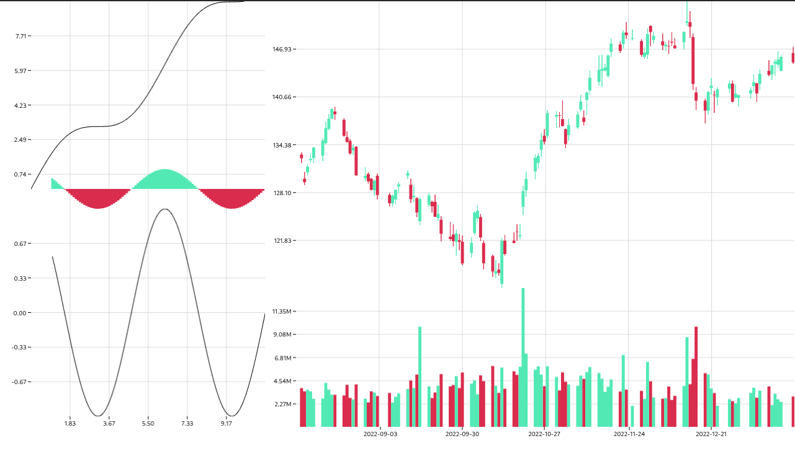

# react-plots &middot; [](https://github.com/kersh1337228/react-plots/blob/master/LICENSE)
React components and common JS plotting tools.

## Details
### Supported data types
```ts
type PointNumeric = [number, number | null];
type ObjectNumeric = {
    timestamp: number;
    [ numericType: string ]: number | null;
    [ anyType: string ]: any;
};

type PointTimeSeries = [string, number | null];
type ObjectTimeSeries = {
    timestamp: string;
    [ numericType: string ]: number | null;
    [ anyType: string ]: any;
};

interface Quotes extends ObjectTimeSeries {
    open: number | null;
    high: number | null;
    low: number | null;
    close: number | null;
    volume: number | null;
}
```

### Drawing data
```ts
    const sin: PointNumeric[] = [],
        cos: PointNumeric[] = [];
    for (let i = 0; i < 10; i += 0.1) {
        const j = round(i, 1);
        sin.push([j, j + Math.sin(j)]);
        cos.push([j + 1, Math.cos(j + 1)]);
    }
    
    const raw = {
        timestamp: ibm.chart.result[0].timestamp,
        ...ibm.chart.result[0].indicators.quote[0]
    };
    const quotes = new Array(raw.timestamp.length).fill(0).map((_, i) => {
        return {
            timestamp: new Date(raw.timestamp[i] * 1000).toLocaleDateString('sv'),
            open: raw.open[i],
            high:raw.high[i],
            low: raw.low[i],
            close: raw.close[i],
            volume: raw.volume[i]
        }
    }) as Quotes[];
```

### Component usage
```tsx
<Figure width={1280} height={720} name={'Test figure'}>
    <AxesGroup
        position={{ row: { start: 1, end: 3 }, column: { start: 1, end: 2 } }}
        name={'Test axes group'}
    >
        <Axes
            position={{ row: { start: 1, end: 2 }, column: { start: 1, end: 2 } }}
            name={'Test axes 1'}
        >
            <Line data={sin} name={'Test line'} />
            <Hist data={cos} name={'Test histogram'} />
        </Axes>
        <Axes
            position={{ row: { start: 2, end: 3 }, column: { start: 1, end: 2 } }}
            name={'Test axes 2'}
        >
            <Line data={cos} name={'Test line'} />
        </Axes>
    </AxesGroup>
    <AxesGroup
        position={{ row: { start: 1, end: 3 }, column: { start: 2, end: 4 } }}
        name={'Test axes 3'}
    >
        <Axes
            position={{ row: { start: 1, end: 3 }, column: { start: 1, end: 2 } }}
            name={'IBM Quotes'}
        >
            <Candle data={quotes} name={'IBM'} />
        </Axes>
        <Axes
            position={{ row: { start: 3, end: 4 }, column: { start: 1, end: 2 } }}
            name={'IBM Volumes'}
        >
            <VolumeHist data={quotes} name={'IBM'} />
        </Axes>
    </AxesGroup>
</Figure>
```
### Result

